  

 

<table width="100%">
<tr>
<td width="35%" valign="middle" align="center">

 

<em>🖱️ Click to move particles</em>

</td>
<td width="65%" valign="middle">

### About

Computer Science and Engineering student building deployable software across full-stack development, machine learning, computer vision, and developer tooling. Currently focused on backend architecture (APIs, auth, role-aware data access), applied AI systems (ML pipelines, LLM tooling, computer vision), and DSA/systems problem solving.

> I like projects where the architecture matters: secure APIs, reliable data flows, useful AI features, and interfaces that feel clear instead of noisy.

| Shipped Builds | Live Demos | Conference Papers | Current CGPA |
|:---:|:---:|:---:|:---:|
| **6** | **3** | **1** | **8.44** / 10 |

</td>
</tr>
</table>

 

### Tech Stack

**Backend** &nbsp;

**AI / ML** &nbsp;

**Frontend** &nbsp;

**Data & Tools** &nbsp;

 

### Featured Projects

<table>
<tr>
<td width="50%" valign="top">

**[FlashMind](https://github.com/rohithsheregar/FlashMind)**
 AI-powered study companion — turns documents into flashcards, quizzes, summaries, and mind maps.
 `Python` `Flask` `MongoDB` `LLM`
 [Live demo →](https://flashmind-ypqc.onrender.com/)

</td>
<td width="50%" valign="top">

**[Illegal Bilge-Dumping Detection](https://github.com/rohithsheregar/Oil-Spill-Detection)**
 4-member team project detecting illegal oil discharge via Sentinel-1 SAR + AIS fusion, reaching 79% combined anomaly-detection accuracy. Research paper in preparation.
 `PyTorch` `Isolation Forest` `Random Forest` `SAR` `AIS`

</td>
</tr>
<tr>
<td width="50%" valign="top">

**[ContextOS](https://github.com/rohithsheregar/ContextOS)**
 Local-first CLI daemon published on PyPI (`pip install contextos-daemon`) that records developer activity and answers natural-language questions about past work.
 `Python` `SQLite` `sqlite-vec` `ONNX` `PyPI`

</td>
<td width="50%" valign="top">

**[College Feedback System](https://github.com/rohithsheregar/Feedback-System)**
 Role-based academic feedback platform with dynamic questionnaires and faculty analytics.
 `Java` `Spring Boot` `MySQL`
 [Live demo →](https://feedback-system-w0gj.onrender.com)

</td>
</tr>
<tr>
<td width="50%" valign="top">

**[React Scrollytelling](https://github.com/rohithsheregar/React-Mini-Project)**
 Scroll-driven storytelling site with animated transitions and lightweight 3D.
 `React` `Three.js` `GSAP`
 [Live demo →](https://react-mini-project-team15.netlify.app/)

</td>
<td width="50%" valign="top">

**[Ludo Game](https://github.com/rohithsheregar/Ludo)**
 Four-player Ludo built in C++ with a full turn-based rules engine.
 `C++` `OOP` `Game Logic`

</td>
</tr>
</table>

 

<strong>📜 Certifications</strong>

 

- HackerRank Software Engineer Skill Certification
- Anthropic Academy — Building with the Claude API

 

<strong>🎓 Academics</strong>

 

| | |
|---|---|
| **Degree** | B.E. Computer Science & Engineering |
| **Institution** | Shri Madhwa Vadiraja Institute of Technology and Management (SMVITM) |
| **University** | Visvesvaraya Technological University (VTU) |
| **CGPA** | 8.44 / 10 |
| **Expected Graduation** | 2027 |

 

<strong>🏆 Participation & Achievements</strong>

 

- **National Conference Paper Presentation** — Presented the FlashMind project at a national-level conference, VCET, Puttur, Karnataka.
- **College Hackathon** — Participated in a hackathon at SMVITM, gaining hands-on experience in rapid prototyping and collaborative development.

 

### GitHub Stats

 

 

 

### Contribution Snake

<picture>
  <source media="(prefers-color-scheme: dark)" srcset="https://raw.githubusercontent.com/rohithsheregar/rohithsheregar/output/github-contribution-grid-snake-dark.svg">
  <source media="(prefers-color-scheme: light)" srcset="https://raw.githubusercontent.com/rohithsheregar/rohithsheregar/output/github-contribution-grid-snake.svg">
  
</picture>

 

  

